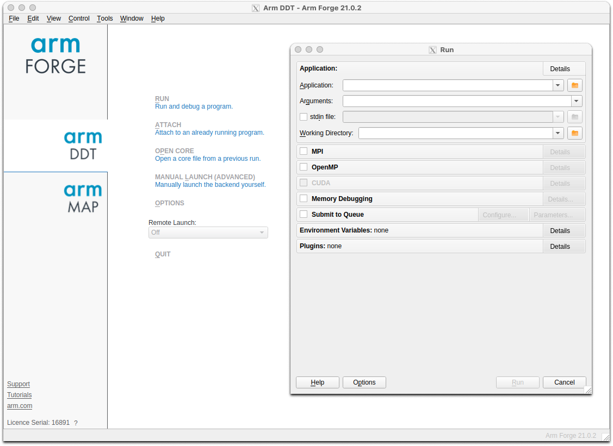
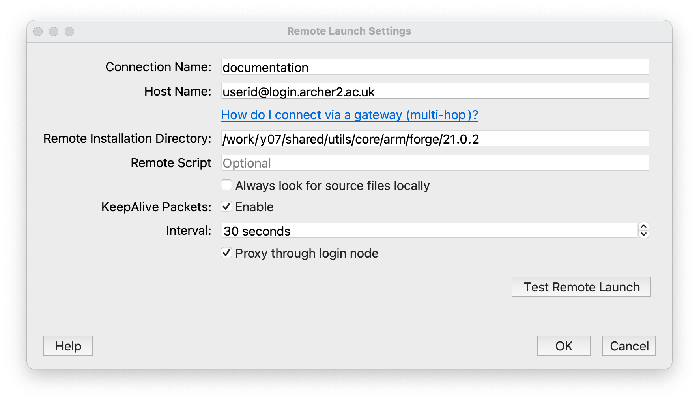

## Linaro Forge


[Linaro Forge](https://www.linaroforge.com/) provides debugging and profiling tools
for MPI parallel applications, and OpenMP or pthreads multi-threaded applications
(and also hydrid MPI/OpenMP). Forge DDT is the debugger and MAP is the profiler.


### User interface

There are two ways of running the Forge user interface. If you have a good internet
connection to ARCHER2, the GUI can be run on the front-end (with an X-connection).
Alternatively, one can download a copy of the Forge remote client to your laptop or desktop,
and run it locally. The remote client should be used if at all possible.

To download the remote client, see the [Forge download pages](https://www.linaroforge.com/downloadForge/).
Version 24.0 is known to work at the time of writing. A section further down this page explains how use the remote client,
see [Connecting with the remote client](#connecting-with-the-remote-client).

### Licensing

ARCHER2 has a licence for up to 2080 tokens, where a token represents an MPI parallel process.
Running Forge DDT/MAP to debug/profile a code running across 16 nodes using 128 MPI ranks per
node would require 2048 tokens. If you wish to run on more nodes, say 32, then it will be
necessary to reduce the number of tasks per node so as to fall below the maximum number of
tokens allowed.

Please note, Forge licence tokens are shared by all ARCHER2 (and [Cirrus](https://www.cirrus.ac.uk/)) users.

To see how many tokens are in use, you can view the licence server status page by first
setting up an SSH tunnel to the node hosting the licence server.

```bash
ssh <username>@login.archer2.ac.uk -L 4241:dvn04:4241
```

You can now view the status page from within a local browser, see [http://localhost:4241/status.html](http://localhost:4241/status.html).


### One time set-up for using Forge

A preliminary step is required to set up the necessary
Forge configuration files that allow DDT and MAP to initialise its
environment correctly so that it can, for example, interact with
the Slurm queue system. These steps should be performed in the `/work`
file system on ARCHER2.

It is recommended that these commands are performed in the top-level work
file system directory for the user account, i.e., `${HOME/home/work}`.

```bash
module load forge
cd ${HOME/home/work}
source ${FORGE_DIR}/config-init
```

Running the `source` command will create a directory `${HOME/home/work}/.forge` that contains the
following files.

```output
system.config  user.config
```

!!! warning
    The `config-init` script may output, `Warning: failed to read system config`.
    Please ignore as subsequent messages should indicate that the new configuration
    files have been created.

Within the `system.config` file you should find that `shared directory` is set to the equivalent of `${HOME/home/work/.forge}`.
That directory will also store other relevant files when Forge is run.

### Using DDT

DDT (**D**istributed **D**ebugging **T**ool) provides an easy-to-use graphical
interface for source-level debugging of compiled C/C++ or Fortran codes.
It can be used for non-interactive debugging, and there
is also some limited support for python debugging.

#### Preparation

To prepare your program for debugging, compile and link in the normal way
but remember to include the `-g` compiler option to retain symbolic
information in the executable. For some programs, it may be necessary
to reduce the optimisation to `-O0` to obtain full and consistent
information. However, this in itself can change the behaviour of bugs,
so some experimentation may be necessary.

#### Post-mortem debugging

A non-interactive method of debugging is available which allows information
to be obtained on the state of the execution at the point of failure in a
batch job.

Such a job can be submitted to the batch system in the usual way. The
relevant command to start the executable is as follows.

```slurm
# ... Slurm batch commands as usual ...

module load forge

export OMP_NUM_THREADS=16
export OMP_PLACES=cores

# Ensure the cpus-per-task option is propagated to srun commands
export SRUN_CPUS_PER_TASK=$SLURM_CPUS_PER_TASK

ddt --verbose --offline --mpi=slurm --np 8 \
    --mem-debug=fast --check-bounds=before \
    ./my_executable
```

The parallel launch is delegated to `ddt` and the `--mpi=slurm` option
indicates to `ddt` that the relevant queue system is Slurm
(there is no explicit `srun`). It will also be
necessary to state explicitly to `ddt` the number of processes
required (here `--np 8`). For other options see, e.g., `ddt --help`.

Note that higher levels of memory debugging can result in extremely
slow execution. The example given above uses the default
`--mem-debug=fast` which should be a reasonable first choice.

Execution will produce a `.html` format report which can be used
to examine the state of execution at the point of failure.


#### Interactive debugging: using the client to submit a batch job

You can also start the client interactively (for details of remote launch, see [Connecting with the remote client](#connecting-with-the-remote-client)).

```bash
module load forge
ddt
```

This should start a window as shown below. Click on the ***DDT*** panel on
the left, and then on the ***Run and debug a program*** option. This
will bring up the ***Run*** dialogue as shown.

Note:

* One can start either DDT or MAP by clicking the appropriate panel on
the left-hand side;

* If the license has connected successfully, a serial number will be
shown in small text at the lower left.




In the ***Application*** sub panel of the ***Run*** dialog box, details of the
executable, command line arguments or data files, the working directory
and so on should be entered.

Click the ***MPI*** checkbox and specify the MPI implementation. This is done
by clicking the ***Details*** button and then the ***Change*** button.
Choose the ***SLURM (generic)*** implementation from the drop-down menu
and click ***OK***. You can then specify the required number of nodes/processes
and so on.

Click the ***OpenMP*** checkbox and select the relevant number of threads
(if there is no OpenMP in the application itself, select 1 thread).

Click the ***Submit to Queue*** checkbox and then the associated ***Configure***
button. A new set of options will appear such as ***Submission template file***,
where you can enter `${FORGE_DIR}/templates/archer2.qtf` and click ***OK***.
This template file provides many of the options required for a standard batch job.
You will then need to click on the ***Queue Parameters*** button in the same
section and specify the relevant project budget, see the ***Account*** entry.

The default queue template file configuration uses the short QoS with the
standard time limit of 20 minutes. If something different is required,
one can edit the settings. Alternatively, one can copy the `archer2.qtf` file
(to `${HOME/home/work}/.forge`) and make the relevant changes. This new
template file can then be specified in the dialog window.

There may be a short delay while the sbatch job starts. Debugging should
then proceed as described in the [Linaro Forge documentation](https://docs.linaroforge.com/24.0/html/forge/ddt/index.html).


### Using MAP

Load the `forge` module:

```bash
module load forge
```

#### Linking

MAP uses two small libraries to collect data from your program. These
are called `map-sampler` and `map-sampler-pmpi`. On ARCHER2, the linking
of these libraries is usually done automatically via the LD_PRELOAD
mechanism, but only if your program is dynamically linked. Otherwise, you
will need to link the MAP libraries manually by providing explicit link options.

The library paths specified in the link options will depend on the programming
environment you are using as well as the Cray programming release. Here are the
paths for each of the compiler environments consistent with the Cray Programming
Release (CPE) 22.12 using the default OFI as the low-level comms protocol:

- `PrgEnv-cray`: `${FORGE_DIR}/map/libs/default/cray/ofi`
- `PrgEnv-gnu`: `${FORGE_DIR}/map/libs/default/gnu/ofi`
- `PrgEnv-aocc`: `${FORGE_DIR}/map/libs/default/aocc/ofi`

For example, for `PrgEnv-gnu` the additional options required at link time
are given below.
```
-L${FORGE_DIR}/map/libs/default/gnu/ofi \
-lmap-sampler-pmpi -lmap-sampler \
-Wl,--eh-frame-hdr -Wl,-rpath=${FORGE_DIR}/map/libs/default/gnu/ofi
```

The MAP libraries for other Cray programming releases can be found under
`${FORGE_DIR}/map/libs`. If you require MAP libraries built for the UCX
comms protocol, simply replace `ofi` with `ucx` in the library path.

#### Generating a profile

Submit a batch job in the usual way, and include the lines:

```slurm
# ... Slurm batch commands as usual ...

module load forge

# Ensure the cpus-per-task option is propagated to srun commands
export SRUN_CPUS_PER_TASK=$SLURM_CPUS_PER_TASK

map -n <number of MPI processes> --mpi=slurm --mpiargs="--hint=nomultithread --distribution=block:block" --profile ./my_executable
```

Successful execution will generate a file with a `.map` extension.

This `.map` file may be viewed via the GUI (start with either `map` or
`forge`) by selecting the
***Load a profile data file from a previous run*** option. The resulting
file selection dialog box can then be used to locate the `.map` file.


### Connecting with the remote client

If one starts the Forge client on e.g., a laptop, one should see the
main window as shown above. Select ***Remote Launch*** and then ***Configure*** from the
drop-down menu. In the ***Configure Remote Connections*** dialog box
click ***Add***. The following window should be displayed. Fill
in the fields as shown. The ***Connection Name*** is just a tag
for convenience (useful if a number of different accounts are
in use). The ***Host Name*** should be as shown with the appropriate
username. The ***Remote Installation Directory*** should be exactly as
shown. The ***Remote Script*** is needed to execute additional environment
commands on connection. A default script is provided in the location
shown.

```output
/work/y07/shared/utils/core/forge/latest/remote-init
```

Other settings can be as shown. Remember to click ***OK*** when done.




From the ***Remote Launch*** menu you should now see the new Connection
Name. Select this, and enter the relevant ssh passphase and machine
password to connect. A remote connection will allow you to debug,
or view a profile, as discussed above.

If different commands are required on connection, a copy of the
`remote-init` script can be placed in, e.g., `${HOME/home/work}/.forge`
and edited as necessary. The full path of the new script should then be
specified in the remote launch settings dialog box.
Note that the script changes the directory to the `/work/` file system so
that batch submissions via `sbatch` will not be rejected.

Finally, note that `ssh` may need to be configured so that it picks up
the correct local public key file. This may be done, e.g., via the
local `.ssh/config` configuration file.

## Useful links


  - [Forge User Guide](https://www.linaroforge.com/documentation/)
  - More information on [X-window connections to ARCHER2](https://docs.archer2.ac.uk/user-guide/connecting/#logging-in).
