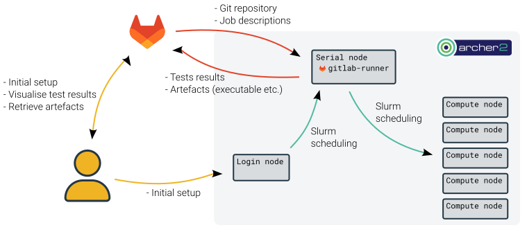

# Gitlab CI/CD

[Gitlab](https://gitlab.com) is a DevOps platform that combines a git hosting service as well as a powerful CI/CD (continuous integration/continuous development) framework. 

This page explains how to run CI/CD jobs on ARCHER2 while keeping the integration with gitlab-ci. Your gitlab repository will communicate with ARCHER2 via the `gitlab-runner`, an executable constantly running on ARCHER2. It is responsible for authenticating to the gitlab repository, retrieving the source code, running jobs -either locally or using slurm-, and finally sending artefacts and results back to the gitlab server and accessible via its user interface.

To achieve this, the ``gitlab-runner`` needs to be always running (idling most of the time) with an access to the internet and be able to submit jobs. On ARCHER2 this will be done by running it on the serial queue.




## Useful links

  - [Gitlab-ci documentation](https://docs.gitlab.com/ee/ci/)
  - [Example gitlab repository with CI/CD on ARCHER2](https://git.ecdf.ed.ac.uk/slemaire/cse-ci-tests)

## Initial setup

All the tools associated to gitlab-ci are accessible in the module ``gitlab-ci`` that should be loaded with:

```sh
module load gitlab-ci
```

### Runner registration

This step authenticates your gitlab repository with the ``gitlab-runner`` on ARCHER2. Go to **Settings -> CI/CD**, then **expand** the **Runners** item. Under **Project runners** click **New project runner**.
Select **Linux**, add tags if you want or tick **Run untagged jobs** if you want all the CI jobs to be run on ARCHER2. Finish by clicking on **Create runner**.

You can now run the command that is displayed in the **Step 1** section (`gitlab-runner register --url....`). You will be prompted for several questions. Reply as follow:

- *Enter the GitLab instance URL*: just hit enter as the default is already selected
- Enter a name for the runner: `ARCHER2`
- *Enter an executor*: `custom`

If successful it should now read: **Runner registered successfully.**

### Configuration

Once the runner is registered, a configuration file is created in `~/.gitlab-runner/config.toml`. You will need to edit it and add the `config_exec` and `run_exec` lines like in the example below. Also make sure you edit/add the two `concurrent` lines to allow multiple jobs to be run simultaneously.
Finally, you have to specify the email address associated to your gitlab account inside the `run_args` parameter. This will ensure that you are the only authorised user to run pipelines with your ARCHER2 account.

```toml
concurrent = 10
check_interval = 0
shutdown_timeout = 0

[session_server]
  session_timeout = 1800

[[runners]]
  name = "NAME"
  url = "YOUR URL"
  id = ID
  token = TOKEN
  token_obtained_at = 2023-05-19T15:05:07Z
  token_expires_at = 0001-01-01T00:00:00Z
  executor = "custom"
  [runners.custom]
    concurrent = 10
    config_exec = "gitlab-ci-config.sh"
    run_exec = "gitlab-ci-run.py"
    run_args = [ "YOUR_EMAIL_ADDRESS" ]
```


## Launch gitlab-runner

CI/CD jobs need the `gitlab-runner` to be continuously running, which is done using the `serial` queue on ARCHER2. And, because the `serial` queue is limited to 24h long jobs, the jobfile available in the gitlab-ci module will resubmit itself to be continuously running. The path of the jobfile is written in the environment variable `$GITLAB_CI_JOBFILE` so the `gitlab-runner` can be submitted and run with:

```sh
module load gitlab-ci
sbatch $GITLAB_CI_JOBFILE
```

!!! note
    For initial setup and debugging, the login node can be used for running the gitlab-runner. This can be done using `gitlab-runner run`.
    

## Repository configuration

Because gitlab CI jobs will be run by slurm, additional parameters and variables are needed in your repository `.gitlab-ci.yml`.

#### With slurm
Here is an example configuration for running a CI job with slurm. Make sure you adapt the `account` field with your project code:
```yaml
test-slurm:
  variables:
    ON_COMPUTE: "TRUE"
    SLURM_job_name: gitlab-ci-job
    SLURM_account: z19
    SLURM_partition: standard
    SLURM_qos: short
    SLURM_time: "00:03:00"
    SLURM_nodes: 1
    SLURM_tasks_per_node: 2
  script:
    - module load xthi
    - srun xthi_mpi
```

#### Without slurm (login node/serial queue)
If a job doesn't need to be submitted to the compute node but can be run directly where the `gitlab-runner` is running, one just need to set `ON_COMPUTE` to `FALSE`.

```yaml
test-local:
  variables:
    ON_COMPUTE: "FALSE"
  script:
    - echo "I am running on $HOSTNAME"
```

#### Complete example
Finally, like any variable in the `.gitlab-ci.yml`, slurm variables can be defined globally instead of locally per test, or even outside the `gitlab-ci.yml` file. Here is a more realistic complete example: 

```yaml
variables:
  SLURM_job_name: gitlab-ci-job
  SLURM_account: z19
  SLURM_partition: standard
  SLURM_qos: short

test-slurm:
  variables:
    ON_COMPUTE: "TRUE"
    SLURM_time: "00:03:00"
    SLURM_nodes: 1
    SLURM_tasks_per_node: 2
  script:
    - module load xthi
    - srun xthi_mpi

test-local:
  variables:
    ON_COMPUTE: "FALSE"
  script:
    - echo "I am running on $HOSTNAME"
```

The supported list of slurm parameter is:

| SBATCH parameter    | gitlab-ci variable    |
|---------------------|-----------------------|
| `--job-name`        | `SLURM_job_name`      |
| `--time`            | `SLURM_time`          |
| `--nodes`           | `SLURM_nodes`         |
| `--tasks-per-node`  | `SLURM_tasks_per_node`|
| `--cpus-per-task`   | `SLURM_cpus_per_task` |
| `--ntasks`          | `SLURM_ntasks`        |
| `--account`         | `SLURM_account`       |
| `--partition`       | `SLURM_partition`     |
| `--qos`             | `SLURM_qos`           |
| `--exclusive`       | `SLURM_exclusive`     |

!!! note 
    Only strings can be passed as a variable reliably, so make sure to use double quotes (`"`) around `TRUE`/`FALSE`, and `00:02:00` for example or they won't be interpreted properly.


#### Example repository
The repository at https://git.ecdf.ed.ac.uk/slemaire/cse-ci-tests can be used as an example for building an application and running it on the compute node.

