# Globus

Globus is a service that enables high-performance and convenient data transfer and sharing of large amounts of data.

- [Globus website](https://www.globus.org/)
- [Globus documentation and tutorials](https://docs.globus.org/guides/)

## Using Globus on ARCHER2

The ARCHER2 filesystems have a Globus Collection (formerly known as an endpoint) with the name "Archer2 file systems"
A full step-by-step guide on transferring data to/from ARCHER2 is provided below

## Step-by-step example

### Setting up ARCHER2 filesystems

Navigate to [https://app.globus.org](https://app.globus.org)

Log in with your Globus identity (this could be a globusid.org or other identity)

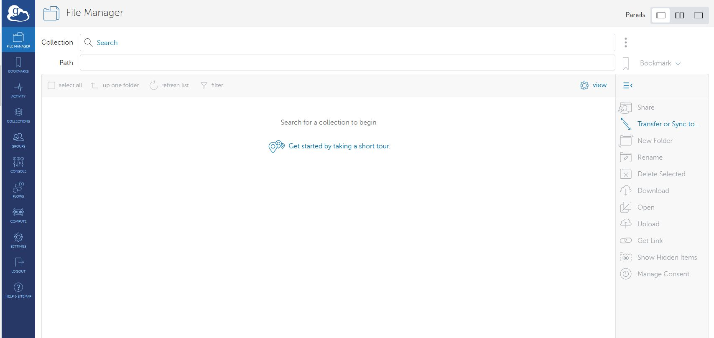


In File Manager, use the search tool to search for “Archer2 file systems”. Select it.

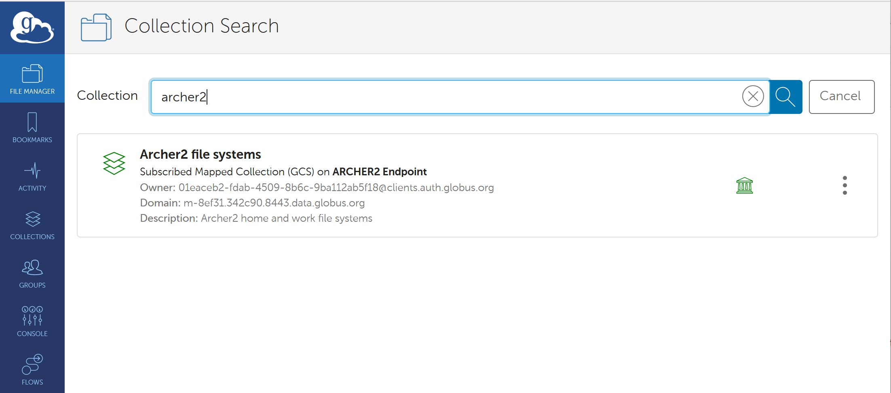

In the transfer pane, you are told that Authentication/Consent is required. Click Continue.

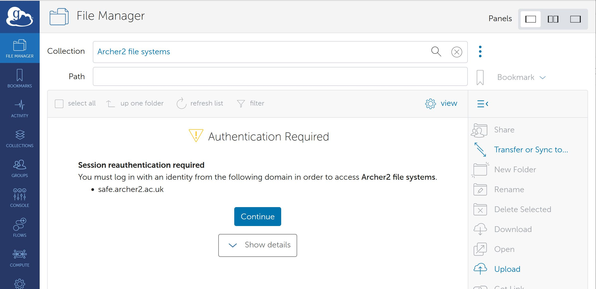

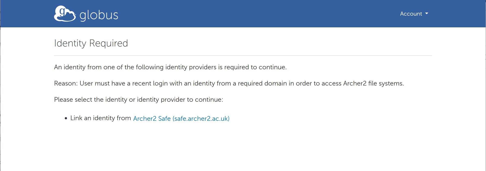

Click on the ARCHER2 Safe (safe.epcc.ed.ac.uk) link

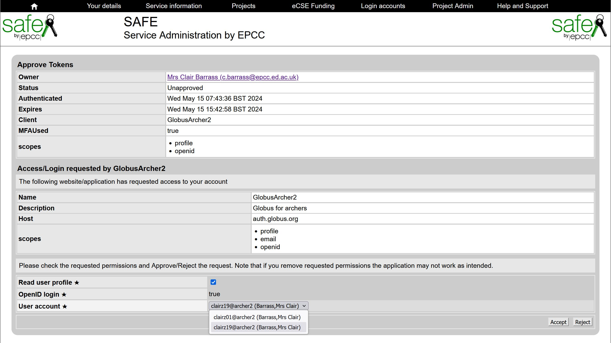

Select the correct User account (if you have more than one)

Click Accept

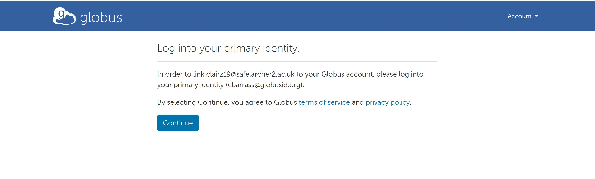

Now confirm your Globus credentials – click Continue

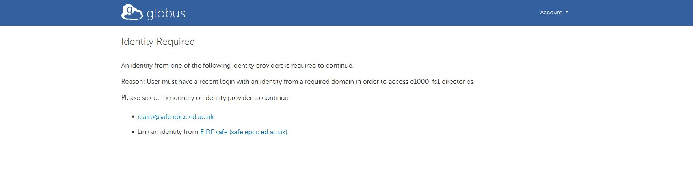

Click on the SAFE ID you selected previously

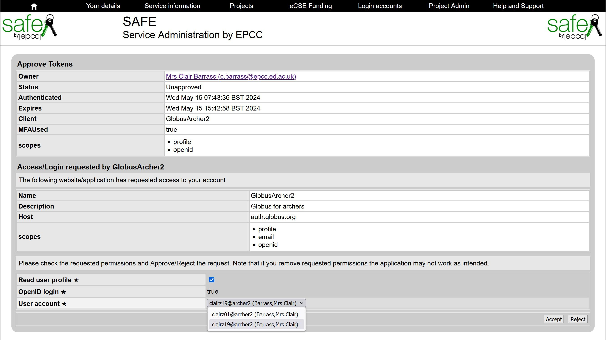

Make sure the correct User account is selected and Accept again

Your ARCHER2 /home directory will be shown 

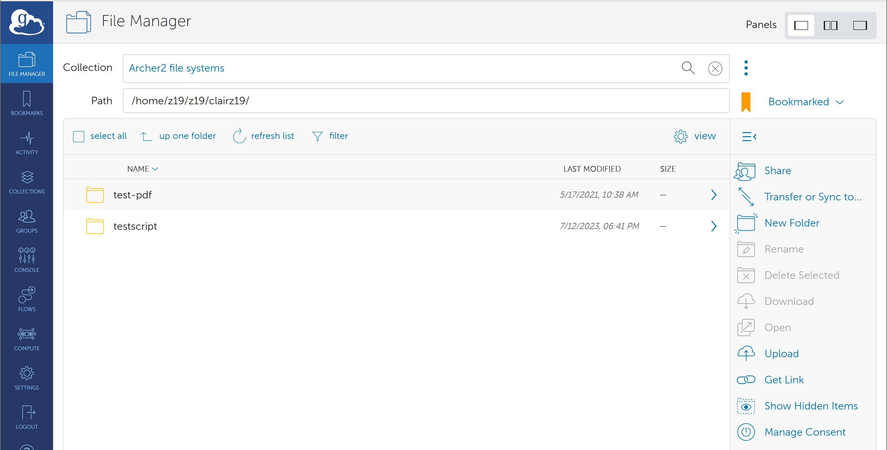

You can switch to viewing e.g. your /work directory by editing the path, or using the "up one folder" and selecting folders to move down the tree, as required

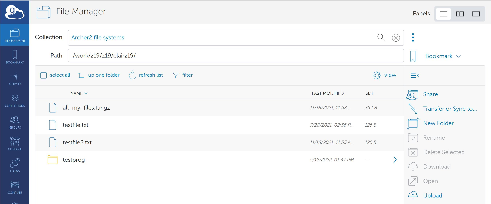


### Setting up the other end of the transfer

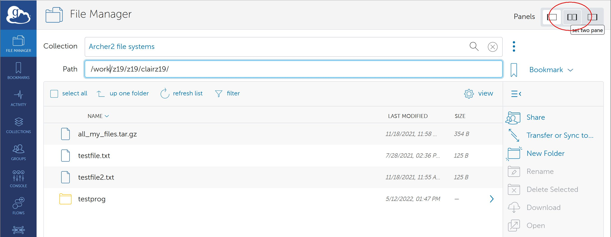

Make sure you select two-panel view mode

#### Laptop

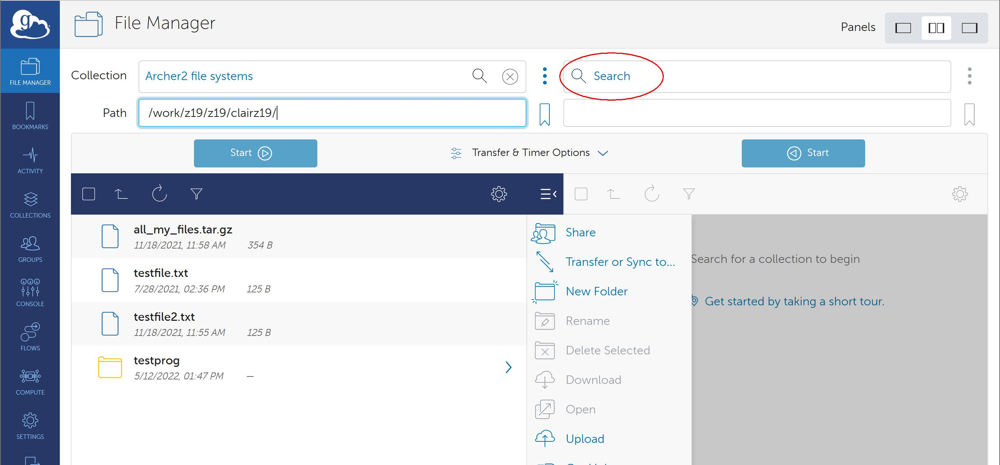

If you wish to transfer data to/from your personal laptop or other device, click on the Collection Search in the right-hand panel

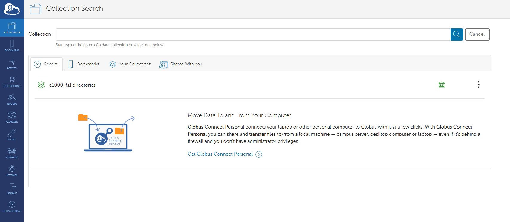

Use the link to “Get Globus Connect Personal” to create a Collection for your local drive.

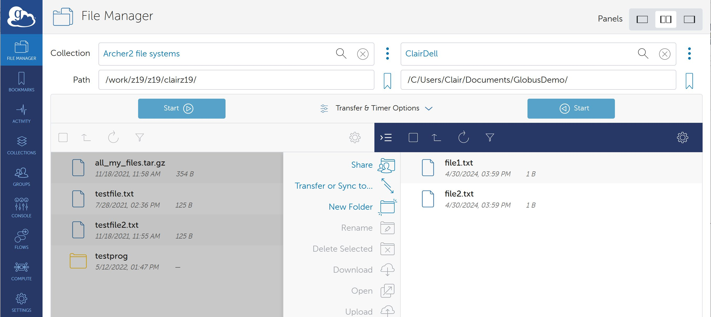

#### Other server e.g. JASMIN 

If you wish to connect to another server, you will need to search for the Collection e.g. JASMIN Default Collection and authenticate

Please see the [JASMIN Globus page for more information](https://help.jasmin.ac.uk/docs/data-transfer/globus-transfers-with-jasmin/)

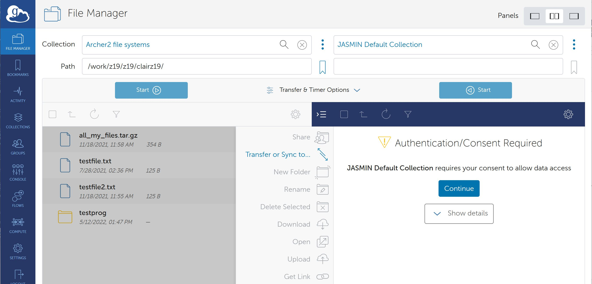

### Setting up and initiating the transfer

Once you are connected to both the Source and Destination Collections, you can use the File Manager to select the files to be transferred, and then click the Start button to initiate the transfer

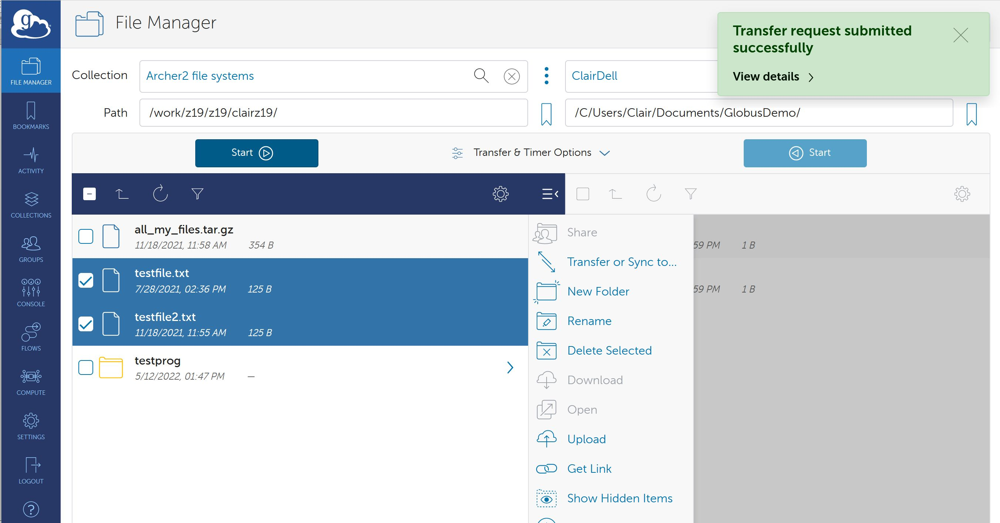

A pop-up will appear once the Transfer request has been submitted successfully

Clicking on the “View Details” will show the progress and final status of the transfer

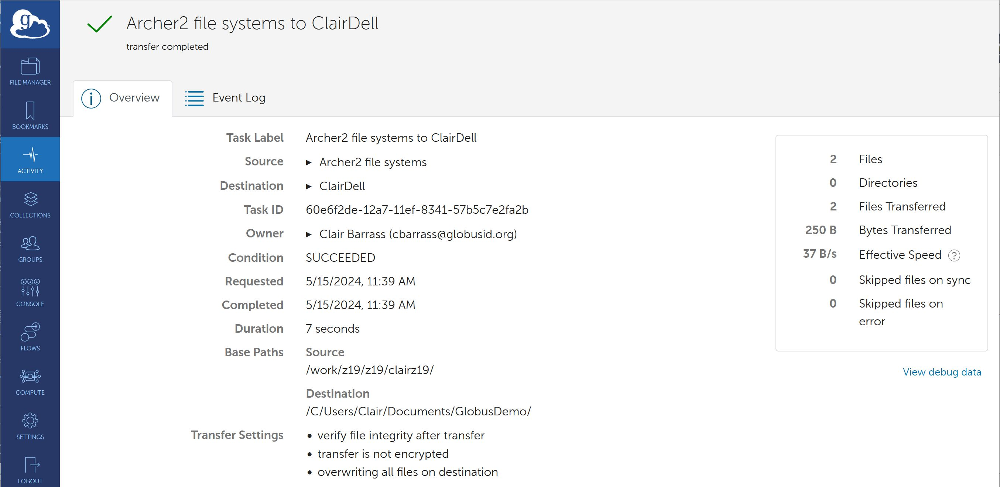

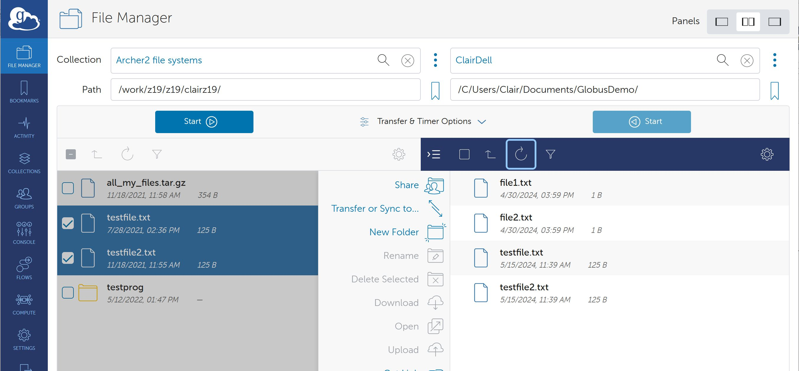

### Using a different ARCHER2 account

If you want to use Globus with a different account on ARCHER2, you will have to go to Settings

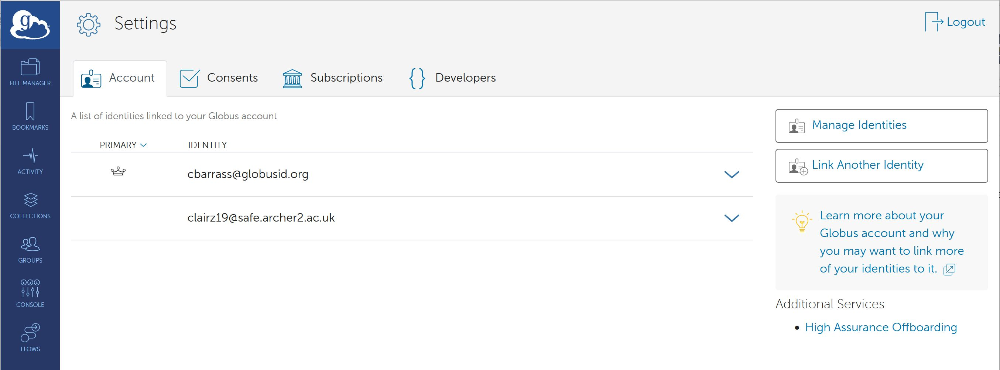

Manage Identities

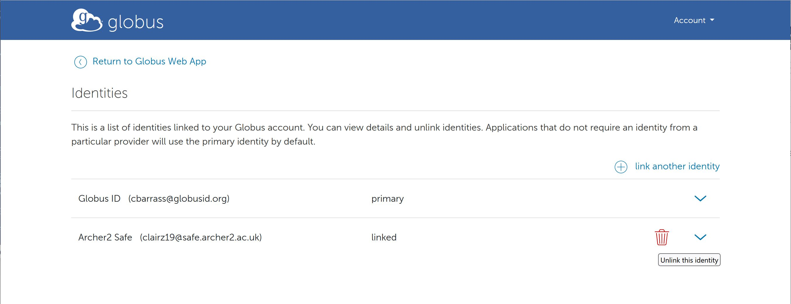

And Unlink the current ARCHER2 safe identity, then repeat the link process with the other ARCHER2 account

## Globus Command Line Interface (CLI)

The Globus CLI is also available on ARCHER2 for transferring data. You can make it available with

```
module load globus-cli
```

For more information on use, see the [Globus CLI documentation](https://docs.globus.org/cli/).