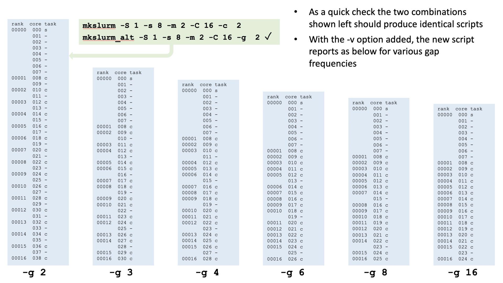
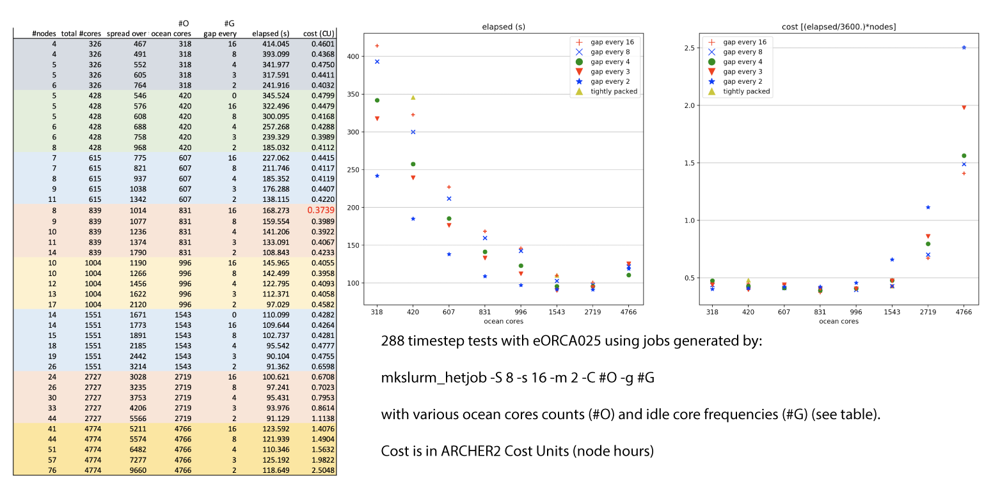

# NEMO

NEMO (Nucleus for European Modelling of the Ocean) is a state-of-the-art
framework for research activities and forecasting services in ocean and
climate sciences, developed in a sustainable way by a European
consortium.

## Useful Links

  - [NEMO home page](https://www.nemo-ocean.eu)
  - [NEMO documentation](https://forge.ipsl.jussieu.fr/nemo/chrome/site/doc/NEMO/guide/html/guide.html)
  - [NEMO users' area](http://forge.ipsl.jussieu.fr/nemo/wiki/Users), which includes information on obtaining and downloading the latest source code releases.

NEMO is released under a CeCILL license and is freely available to all
users on ARCHER2.

## Compiling NEMO

A central install of NEMO is not appropriate for most users of ARCHER2 since
many configurations will want to add bespoke code changes.

The latest instructions for building NEMO on ARCHER2 are found in the Github
repository of build instructions:

- [Build instructions for NEMO on
  GitHub](https://github.com/hpc-uk/build-instructions/tree/main/apps/NEMO)

## Using NEMO on ARCHER2

Typical NEMO production runs perform significant I/O management to handle
the very large volumes of data associated with ocean modelling. To address
this, NEMO ocean clients are interfaced with XIOS I/O servers. XIOS is a
library which manages NetCDF outputs for climate models. NEMO uses XIOS to
simplify the I/O management and introduce dedicated processors to manage large
volumes of data.

Users can choose to run NEMO in attached or detached mode:
- In attached mode each processor acts as an ocean client and I/O-server process.
- In detached mode ocean clients and external XIOS I/O-server processors are separately defined.

Running NEMO in attached mode can be done with a simple submission script
specifying both the NEMO and XIOS executable to ```srun```. However, typical
production runs of NEMO will perform significant I/O management and will be
unable to run in attached mode.

Detached mode introduces external XIOS I/O-servers to help manage the
large volumes of data. This requires users to specify the placement
of clients and servers on different cores throughout the node using
the ```–cpu-bind=map_cpu:<cpu map>``` srun option to define a CPU map
or mask. It is tedious to construct these maps by hand. Instead, Andrew
Coward provides a tool to aid users in the construction submission scripts:

```
/work/n01/shared/nemo/mkslurm_hetjob
/work/n01/shared/nemo/mkslurm_hetjob_Gnu
```

Usage of the script:

```
usage: mkslurm_hetjob [-h] [-S S] [-s S] [-m M] [-C C] [-g G] [-N N] [-t T]
                      [-a A] [-j J] [-v]

Python version of mkslurm_alt by Andrew Coward using HetJob. Server placement
and spacing remains as mkslurm but clients are always tightly packed with a
gap left every "NC_GAP" cores where NC_GAP can be given by the -g argument.
values of 4, 8 or 16 are recommended.

optional arguments:
  -h, --help  show this help message and exit
  -S S        num_servers (default: 4)
  -s S        server_spacing (default: 8)
  -m M        max_servers_per_node (default: 2)
  -C C        num_clients (default: 28)
  -g G        client_gap_interval (default: 4)
  -N N        ncores_per_node (default: 128)
  -t T        time_limit (default: 00:10:00)
  -a A        account (default: n01)
  -j J        job_name (default: nemo_test)
  -v          show human readable hetjobs (default: False)
```

!!! note
    We recommend that you retain your own copy of this script as it is not
    directly provided by the ARCHER2 CSE team and subject to change. Once
    obtained, you can set your own defaults for options in the script.

For example, to run with 4 XIOS I/O-servers (a maximum of 2 per node),
each with sole occupancy of a 16-core NUMA region and 96 ocean cores, spaced
with a idle core in between each, use:

```
./mkslurm_hetjob -S 4 -s 16 -m 2 -C 96 -g 2 > myscript.slurm

INFO:root:Running mkslurm_hetjob -S 4 -s 16 -m 2 -C 96 -g 2 -N 128 -t 00:10:00 -a n01 -j nemo_test -v False
INFO:root:nodes needed= 2 (256)
INFO:root:cores to be used= 100 (256)
```

This has reported that 2 nodes are needed with 100 active cores spread over
256 cores. This will also have produced a submission script "myscript.slurm":

```slurm
#!/bin/bash
#SBATCH --job-name=nemo_test
#SBATCH --time=00:10:00
#SBATCH --account=n01
#SBATCH --partition=standard
#SBATCH --qos=standard

#SBATCH --nodes=2
#SBATCH --ntasks-per-core=1

# Created by: mkslurm_hetjob -S 4 -s 16 -m 2 -C 96 -g 2 -N 128 -t 00:10:00 -a n01 -j nemo_test -v False
module swap craype-network-ofi craype-network-ucx
module swap cray-mpich cray-mpich-ucx
module load cray-hdf5-parallel/1.12.0.7
module load cray-netcdf-hdf5parallel/4.7.4.7
export OMP_NUM_THREADS=1

cat > myscript_wrapper.sh << EOFB
#!/bin/ksh
#
set -A map ./xios_server.exe ./nemo
exec_map=( 0 0 1 1 1 1 1 1 1 1 1 1 1 1 1 1 1 1 1 1 1 1 1 1 1 1 1 1 1 1 1 1 1 1 1 1 1 1 1 1 1 1 1 1 1 1 1 1 1 1 0 0 1 1 1 1 1 1 1 1 1 1 1 1 1 1 1 1 1 1 1 1 1 1 1 1 1 1 1 1 1 1 1 1 1 1 1 1 1 1 1 1 1 1 1 1 1 1 1 1 )
#
exec \${map[\${exec_map[\$SLURM_PROCID]}]}
##
EOFB
chmod u+x ./myscript_wrapper.sh

srun --mem-bind=local \
--ntasks=100 --ntasks-per-node=50 --cpu-bind=v,mask_cpu:0x1,0x10000,0x100000000,0x400000000,0x1000000000,0x4000000000,0x10000000000,0x40000000000,0x100000000000,0x400000000000,0x1000000000000,0x4000000000000,0x10000000000000,0x40000000000000,0x100000000000000,0x400000000000000,0x1000000000000000,0x4000000000000000,0x10000000000000000,0x40000000000000000,0x100000000000000000,0x400000000000000000,0x1000000000000000000,0x4000000000000000000,0x10000000000000000000,0x40000000000000000000,0x100000000000000000000,0x400000000000000000000,0x1000000000000000000000,0x4000000000000000000000,0x10000000000000000000000,0x40000000000000000000000,0x100000000000000000000000,0x400000000000000000000000,0x1000000000000000000000000,0x4000000000000000000000000,0x10000000000000000000000000,0x40000000000000000000000000,0x100000000000000000000000000,0x400000000000000000000000000,0x1000000000000000000000000000,0x4000000000000000000000000000,0x10000000000000000000000000000,0x40000000000000000000000000000,0x100000000000000000000000000000,0x400000000000000000000000000000,0x1000000000000000000000000000000,0x4000000000000000000000000000000,0x10000000000000000000000000000000,0x40000000000000000000000000000000 ./myscript_wrapper.sh
```

Submitting this script in a directory with the nemo and xios_server.exe
executables will run the desired MPMD job. The exec_map array shows the
position of each executable in the rank list (0 = xios_server.exe, 1 = nemo).
For larger core counts the cpu_map can be limited to a single node map which
will be cycled through as many times as necessary.

### How to optimise the performance of NEMO

!!! note
    Our optimisation advice is based on the ARCHER2 4-cabinet preview
    system with the same node architecture as the current ARCHER2 service
    but a total of 1,024 compute nodes. During these investigations we used
    NEMO-4.0.6 and XIOS-2.5.  

Through testing with idealised test cases to optimise the computational
performance (i.e. without the demanding I/O management that is typical of NEMO
production runs), we have found that drastically under-populating the nodes
does not affect the performance of the computation. This indicates that users
can reserve large portions of the nodes without a performance detriment.
Users can run larger simulations by reserving up to 75% of the node can be
reserved for I/O management (i.e. XIOS I/O-servers).

XIOS I/O-servers can be more lightly packed than ocean clients and should be
evenly distributed amongst the nodes i.e. not concentrated on a specific node.
We found that placing 1 XIOS I/O-server per node with 4, 8, and 16 dedicated
cores did not affect the performance. However, the performance was affected
when allocating dedicated I/O-server cores outside of a 16-core NUMA region.
Thus, users should confine XIOS I/O-servers to NUMA regions to improve
performance and benefit from the memory hierarchy.

### A performance investigation

!!! note
    These results were collated during early user testing of the ARCHER2 service by
    Andrew Coward and is subject to change.

This table shows some preliminary results of a repeated 60 day simulation of the
ORCA2_ICE_PISCES, SETTE configuration using various core counts and packing
strategies:


!!! note
    These results used the mkslurm script, now hosted in ```/work/n01/shared/nemo/old_scripts/mkslurm ```

It is clear from the previous results that fully populating an ARCHER2 node is
unlikely to provide the optimal performance for any codes with moderate memory
bandwidth requirements. The explored regular packing strategy does not allow
experimentation with less wasteful packing strategies than half-population
though.

There may be a case, for example, for just leaving every 1 in 4 cores idle, or
every 1 in 8, or even fewer idle cores per node.  The mkslurm_alt script
(/work/n01/shared/nemo/old_scripts/mkslurm_alt) provided a method of generating
cpu-bind maps for exploring these strategies. The script assumed no change in the
packing strategy for the servers but the core spacing argument (-c) for the ocean
cores is replaced by a -g option representing the frequency of a gap in the, otherwise
tightly-packed, ocean cores.



Preliminary tests have been conducted with the ORCA2_ICE_PISCES SETTE test case.
This is a relatively small test case that will fit onto a single node. It is also
small enough to perform well in attached mode. First some baseline tests in
attached mode.


Previous tests used 4 I/O servers each occupying a single NUMA. For this size
model, 2 servers occupying half a NUMA each will suffice.  That leaves 112 cores
with which to try different packing strategies. Is it possible to match or better
this elapsed time on a single node including external I/O servers?  -Yes!  -but
not with an obvious gap frequency:


And activating land suppression can reduce times further:


The optimal two-node solution is also shown (this is quicker but the one node
solution is cheaper).

This leads us to the current iteration of the mkslurm script - mkslurm_hetjob.
Note a tightly-packed placement with no gaps amongst the ocean
processes can be generated using a client gap interval greater than the number
of clients. This script has been used to explore the different placement
strategies with a larger configuration based on eORCA025. In all cases, 8 XIOS
servers were used, each with sole occupancy of a 16-core NUMA and a maximum of 2
servers per node. The rest of the initial 4 nodes (and any subsequent ocean
core-only nodes) were filled with ocean cores at various packing densities (from
tightly packed to half-populated). A summary of the results are shown below.



The limit of scalability for this problem size lies around 1500 cores. One
interesting aspect is that the cost, in terms of node hours, remains fairly flat
up to a thousand processes and the choice of gap placement makes much less
difference as the individual domains shrink. It looks as if, so long as you
avoid inappropriately high numbers of processors, choosing the wrong placement
won't waste your allocation but may waste your time.
