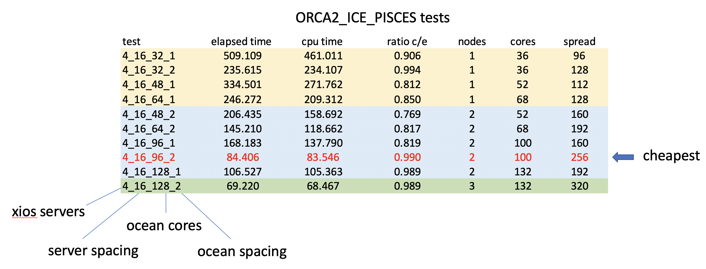
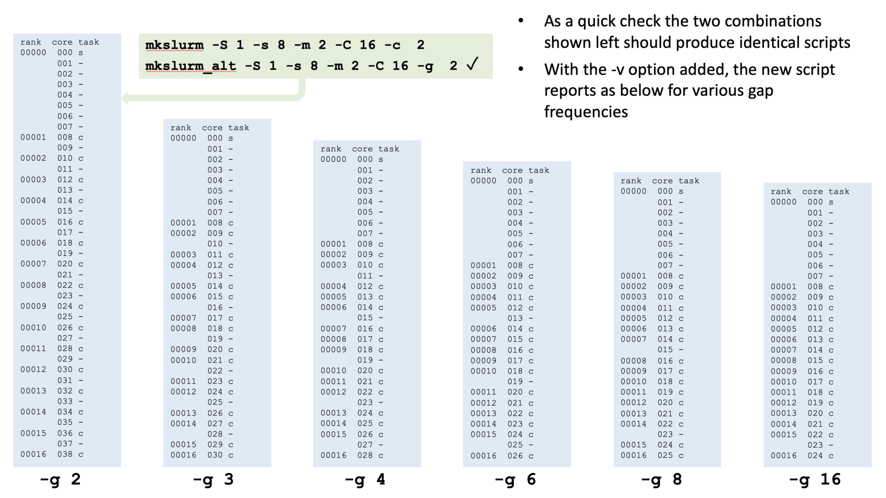
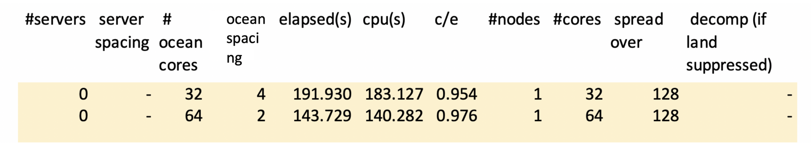
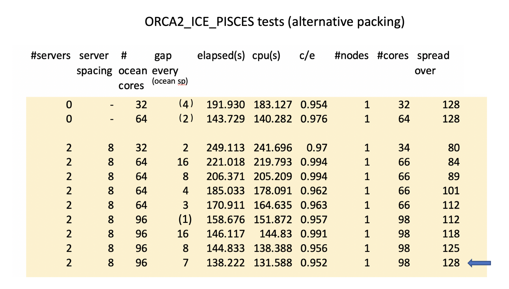
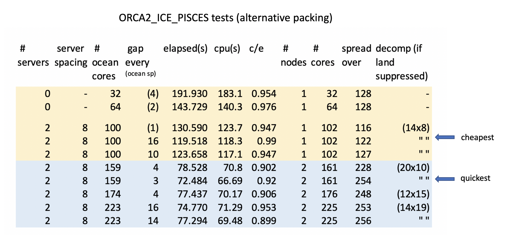
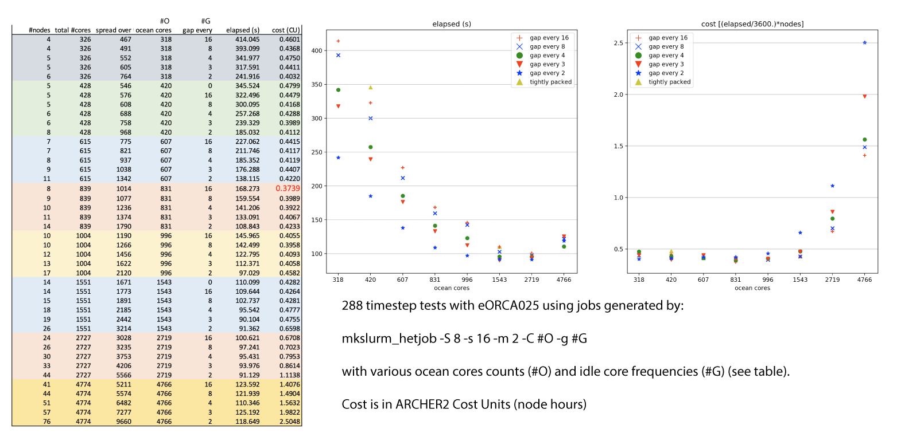

# NEMO

NEMO (Nucleus for European Modelling of the Ocean) is a state-of-the-art
framework for research activities and forecasting services in ocean and
climate sciences, developed in a sustainable way by a European
consortium.

## Useful Links

  - The NEMO home page <https://www.nemo-ocean.eu>
  - NEMO documentation
    <https://forge.ipsl.jussieu.fr/nemo/chrome/site/doc/NEMO/guide/html/NEMO_guide.html>
  - NEMO users' area <http://forge.ipsl.jussieu.fr/nemo/wiki/Users> which includes information on
    obtaining and downloading the latest source code releases. 

NEMO is released under a CeCILL license and if freely available to all
users on ARCHER2.

## Using NEMO on ARCHER2

A central install of NEMO is not appropriate for most users of ARCHER2 since
many configurations will want to add bespoke code changes. There is, however, a
case for providing some central material specific to ARCHER2. This includes:
arch files for compiling on ARCHER2; a pre-compiled version of XIOS and guides
for running NEMO on ARCHER2. The guides provided here address the running of
NEMO as a stand-alone ocean model (albeit with optional sea-ice and external
XIOS i/o servers ) and provide links to some of the material held in the shared
workspace of the n01 (oceans and shelf seas) consortium. The running of full
Earth System Models with NEMO as just one component of a fully interacting,
OASIS-coupled, suite is best dealt with by more comprehensive workflow
management systems such as the Rose and Cylc set-up used by NCAS.

## Setting up the correct environment 

The first point of note is that NEMO will not operate successfully in the
default environment on ARCHER2. To be precise, this statement is true for any
attempts to run NEMO as part of a MPMD task with external XIOS servers. In
attached mode, where no external servers are used and every ocean process acts
as an io server, then the default environment can be used to launch NEMO as a
SPMD task. Since attached mode is not performant at high core counts it is
advisable to standardise on on environment which is suitable for all NEMO
applications. This is currently:

 - Either (starting from the default environment):

```
module unload cray-mpich
module load craype-network-ucx
module load cray-mpich-ucx
module load libfabric
module load cray-hdf5-parallel
module load cray-netcdf-hdf5parallel
module load gcc
```
- Or, equivalently:
```
module -s restore /work/n01/shared/acc/n01_modules/ucx_env
```

If your NEMO tasks are failing at start-up (or possibly hanging) then the
chances are you are attempting to use the wrong mpich library. Note
all investigations to date have focussed on using the Cray compilers.
 
## Enabling FCM to compile in parallel with Cray compilers

FCM is bundled with both NEMO and XIOS and is used by makenemo and make_xios
scripts These scripts accept –j N/-jobs N arguments for parallel builds but the
Cray compilers trip up attempting to load modules which have only just been
built. It seems to be a timing issue because if the -J option is added to inform
the compiler where to look for modules the problem disappears. The -J option
should not be necessary because the -I setting is already given and, according to
the manual, directories given by -J are searched first followed by those given by
-I. The slight difference in priority seems to matter though and parallel builds
will fail with the Cray compilers unless the following change is made to:

```
NEMO/r4.0.X/ext/FCM/lib/Fcm/Config.pm 	(NEMO4 source tree) 
```

and (if compiling xios, not everyone needs to do this, see next section)

```
xios-2.5/tools/FCM/lib/Fcm/Config.pm   (may need to run make_xios once to unpack this)
```

In both cases change: 

```
FC_MODSEARCH => '',             # FC flag, specify "module" path
to
FC_MODSEARCH => '-J',           # FC flag, specify "module" path
```

## Compiling XIOS and NEMO

It is not necessary for everyone to compile XIOS. A compiled version is available in:
```
/work/n01/shared/acc/xios-2.5
```
This was compiled with:
```
./make_xios --prod --arch X86_ARCHER2-Cray --netcdf_lib netcdf4_par --job 16 -full
```
using the:
```
/work/n01/shared/acc/xios-2.5/arch/arch-X86_ARCHER2-Cray.[env,fcm,path] settings
```

The NEMO arch file suggested at the next step will link nemo with the xios libraries
contained therein and copies of the xios_server.exe executable can be taken from
the xios-2.5/bin directory. It is recommended to take copies of this executable
to guard against any possible issues with future updates.

NEMO can be compiled with (for example):

```
./makenemo -n ORCA2_ICE_PISCES_ST -r ORCA2_ICE_PISCES  -m X86_ARCHER2-Cray -j 16
```
once the:
```
/work/n01/shared/acc/arch-X86_ARCHER2-Cray.fcm
```
file has been dropped into the NEMO arch directory. Note this arch file 
currently sets compiler flags of:
```
-em -s integer32 -s real64 -O1 -hflex_mp=intolerant
```

Small gains at higher optimisation levels are offset by much longer compile
times and an inability to attain restartability and reproducibility passes in
some of the standard SETTE tests. Future releases of NEMO (post r4.0.4) will
contain this arch file for ARCHER2. Users of versions 4.0.4 and earlier will
have to manually add this file.

## Building a run script

!!! note
    The following 5 sections describe an evolving approach to running NEMO
    on ARCHER2 that culminated in the recommended method described in the last
    section: [Running heterogeneous jobs](#running-heterogeneous-jobs). If you
    are not interested in the details of how this solution was reached, skip 
    straight to that [final section](#running-heterogeneous-jobs).

Most NEMO applications will want to run in detached mode with separate XIOS
servers.  Remember this is only currently possible using the cray-mpich-ucx
module.  MPMD jobs are more complex to set-up than on ARCHER;  but also more
versatile since executables can be mixed on a node.  Generally, xios_servers
will need to be more lightly packed than NEMO cores because:

 - xios servers have less consistent memory requirements than the ocean cores
 - They generally require more memory and their needs can spike depending on 
   output interval or experimental needs
 - There are far fewer of them than ocean cores so a pragmatic solution might be to
   assign each xios_server an entire NUMA region of its own
 - It also makes sense to avoid concentrating too many xios_servers on any particular node
 - Very large models may require xios_servers to occupy more than one NUMA (TBD)

All this can be achieved using the:
```
 –cpu-bind=map_cpu:<cpu map> 
```
option to srun but it is tedious to construct cpu maps by hand. 
The:
```
/work/n01/shared/acc/mkslurm 
```
script will construct a basic run script using supplied packing arguments.

## The mkslurm script

```
usage: mkslurm [-S num_servers] [-s server_spacing] [-m max_servers_per_node] 
               [-C num_clients] [-c client_spacing] 
               [-t time_limit] [-a account] [-j job_name]
```
It is recommended to take your own copy and set defaults for most of these arguments

For example, to run with 4 xios servers (a maximum of 2 per node), each with
sole occupancy of a 16-core NUMA region and 96 ocean cores, spaced with an idle
core in between each, use:
```
./mkslurm -S 4 -s 16 -m 2 -C 96 -c 2 > myscript.slurm
``` 
This will report (to stderr) that 2 nodes are needed with 100 active cores
spread over 256 cores. It will also echo the equivalent full command (to stderr)
to show the defaults used for those arguments not given, i.e.:
```
Running: mkslurm -S 4 -s 16 -m  4 -C  96 -c  2 -t 00:10:00 -a n01 -j nemo_test
nodes needed= 2 (256)
cores to be used= 100 (256)
```
The slurm script produced is shown in the next section

## Running parallel NEMO jobs

The script produced is:
```
#!/bin/bash
#SBATCH --job-name=nemo_test
#SBATCH --time=00:10:00
#SBATCH --nodes=2
#SBATCH --ntasks=100
#SBATCH --account=n01
#SBATCH --partition=standard
#SBATCH --qos=standard
export OMP_NUM_THREADS=1
module restore /work/n01/shared/acc/n01_modules/ucx_env
#
cat > myscript_wrapper2.sh << EOFB
#!/bin/ksh
#
set -A map ./xios_server.exe ./nemo
exec_map=( 0 0 1 1 1 1 1 1 1 1 1 1 1 1 1 1 1 1 1 1 1 1 1 1 1 1 1 1 1 1 1 1 1 1 1 1 1 1 1 1 1 1 1 1 1 1 1 1 1 1 0 0 1 1 1 1 1 1 1 1 1 1 1 1 1 1 1 1 1 1 1 1 1 1 1 1 1 1 1 1 1 1 1 1 1 1 1 1 1 1 1 1 1 1 1 1 1 1 1 1 )
#
exec \${map[\${exec_map[\$SLURM_PROCID]}]}
##
EOFB
chmod u+x ./myscript_wrapper2.sh
#
srun --mem-bind=local --cpu-bind=v,map_cpu:00,0x10,0x20,0x22,0x24,0x26,0x28,0x2a,0x2c,0x2e,0x30,0x32,0x34,0x36,0x38,0x3a,0x3c,0x3e,0x40,0x42,0x44,0x46,0x48,0x4a,0x4c,0x4e,0x50,0x52,0x54,0x56,0x58,0x5a,0x5c,0x5e,0x60,0x62,0x64,0x66,0x68,0x6a,0x6c,0x6e,0x70,0x72,0x74,0x76,0x78,0x7a,0x7c,0x7e,00,0x10,0x20,0x22,0x24,0x26,0x28,0x2a,0x2c,0x2e,0x30,0x32,0x34,0x36,0x38,0x3a,0x3c,0x3e,0x40,0x42,0x44,0x46,0x48,0x4a,0x4c,0x4e,0x50,0x52,0x54,0x56,0x58,0x5a,0x5c,0x5e,0x60,0x62,0x64,0x66,0x68,0x6a,0x6c,0x6e,0x70,0x72,0x74,0x76,0x78,0x7a,0x7c,0x7e, ./myscript_wrapper2.sh
```

which will run the desired MPMD job providing the xios_server.exe and nemo
executables are in the directory that this script is submitted from. The
exec_map array shows the position of each executable in the rank list
(0=xios_server.exe, 1=nemo). The cpu map gives the hexadecimal number of the
core that will run that executable. For larger core counts the cpu_map can be
limited to a single node map which will be cycled through as many times as
necessary until all the tasks are mapped.

## Some preliminary tests

This table shows the results of a repeated 60 day simulation of the
ORCA2_ICE_PISCES, SETTE configuration using various core counts and packing
strategies:



## Alternative placement strategies

It is clear from the previous results that fully populating an ARCHER2 node is
unlikely to provide the optimal performance for any codes with moderate memory
bandwidth requirements. The regular packing strategy offered by mkslurm does not
allow experimentation with less wasteful packing strategies than half-population
though.

There may be a case, for example, for just leaving every 1 in 4 cores idle, or
every 1 in 8, or even fewer idle cores per node.  The mkslurm_alt script
(/work/n01/shared/acc/mkslurm_alt) provides a method of generating cpu-bind maps
for exploring these strategies.

The script assumes no change in the packing strategy for the servers but the
core spacing argument (-c) for the ocean cores is replaced by a -g option
representing the frequency of a gap in the, otherwise tightly-packed, ocean
cores. A -v option has also been introduced to provide a human-readable
indication of the core usage. I.e.:

```
usage:  mkslurm_alt [-S num_servers] [-s server_spacing] [-m max_servers_per_node] 
                    [-C num_clients] [-g client_gap_interval] [-t time_limit] 
                    [-a account] [-j job_name] [-v]
```




## Tests with alternative packing strategies

Preliminary tests have been conducted with the ORCA2_ICE_PISCES SETTE test case.
This is a relatively small test case that will fit onto  single node. It is also
small enough to perform well in attached mode. First some baseline tests in
attached mode. For 32 and 64 core tests, these are equivalent to running a
mkslurm-generated script with -S 0 and -C 32 -c 4 and -C 64 -c 2, respectively:



Previous tests used 4 I/O servers each occupying a single NUMA. For this size
model, 2 servers occupying half a NUMA each will suffice.  That leaves 112 cores
with which to try different packing strategies.

Is it possible to match or better this elapsed time on a single node including
external I/O servers?  -Yes!  -but not with an obvious gap frequency:



And activating land suppression can reduce times further: 



The optimal two-node solution is also shown (this is quicker but the one node
solution is cheaper).

## Running heterogeneous jobs

There is a critical limitation to the techniques described so far for placing
tasks on the ARCHER2 nodes. That is that the cpu map generated by the mkslurm
and mkslurm_alt scripts is only applied as expected if the layout is identical
on every node. In general, this is not the case for larger NEMO configurations
because:

 * We may only want server processes (possibly mixed with ocean processes) on an initial subset of nodes
 * followed by a set of fully utilised (albeit, possibly,  with regular gaps) nodes of only ocean processes
 * followed (possibly) by a final node with fewer ocean processes

To exercise precise control over the placement in each of these parts will
require different cpu maps or masks. This can be achieved by configuring each
part as a component of a heterogeneous job-pack. The basic principle is
explained here:
[Heterogeneous jobs](https://docs.archer2.ac.uk/user-guide/scheduler/#heterogeneous-jobs-for-a-shared-mpi_com_world)

A python-based extension of the mkslurm_alt functionality has been provided to
automatically generate such job-scripts. The script is located here:

```
/work/n01/shared/malmans/mkslurm_hetjob
```
The script generates a 'job-pack' (heterogeneous job in modern Slurm parlance)
of up to three parts, corresponding to the possible three components and
generates the correct cpu placement for each part. The jobs have separate
entries in the queue but can only be run or cancelled as a pack and all run
within the same MPI communicator when they start.

Arguments to the script match those of mkslurm_alt, i.e.:

```
usage: mkslurm_hetjob [-h] [-S S] [-s S] [-m M] [-C C] [-g G] [-N N] [-t T]
                      [-a A] [-j J] [-v]

Python version of mkslurm_alt using HetJob. Server placement
and spacing remains as mkslurm but clients are always tightly packed with a
gap left every "NC_GAP" cores where NC_GAP can be given by the -g argument.
values of 4, 8 or 16 are recommended.

optional arguments:
  -h, --help  show this help message and exit
  -S S        num_servers (default: 4)
  -s S        server_spacing (default: 8)
  -m M        max_servers_per_node (default: 2)
  -C C        num_clients (default: 28)
  -g G        client_gap_interval (default: 4)
  -N N        ncores_per_node (default: 128)
  -t T        time_limit (default: 00:10:00)
  -a A        account (default: n01)
  -j J        job_name (default: nemo_test)
  -v          show human readable hetjobs (default: False)
```

The use of this script to generate job scripts for most nemo, ocean-only runs is
recommended. Note a tightly-packed placement with no gaps amongst the ocean
processes can be generated using a client gap interval greater than the number
of clients. This script has been used to explore the different placement
strategies with a larger configuration based on eORCA025. In all cases, 8 XIOS
servers were used, each with sole occupancy of a 16-core NUMA and a maximum of 2
servers per node. The rest of the initial 4 nodes (and any subsequent ocean
core-only nodes) were filled with ocean cores at various packing densities (from
tightly packed to half-populated). A summary of the results are shown below.



The limit of scalability for this problem size lies around 1500 cores. One
interesting aspect is that the cost, in terms of node hours, remains fairly flat
up to a thousand processes and the choice of gap placement makes much less
difference as the individual domains shrink. It looks as if, so long as you
avoid inappropriately high numbers of processors, choosing the wrong placement
won't waste your allocation but may waste your time.

!!! note
    This information is based on experience during early user testing and
    is subject to change
