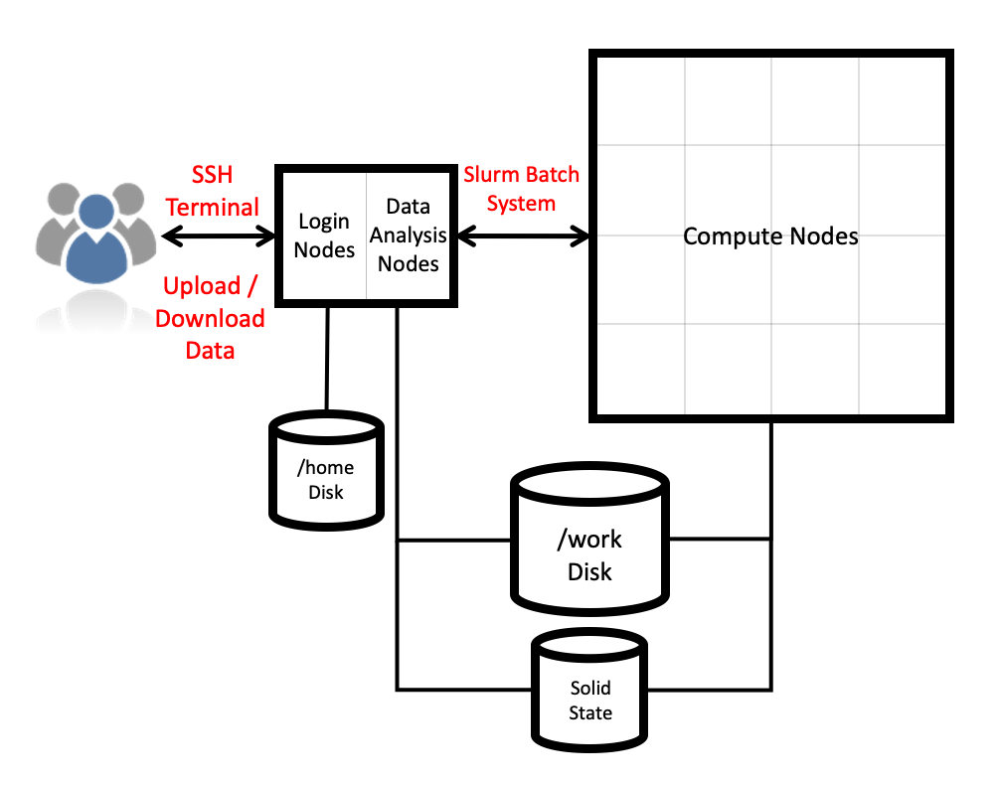
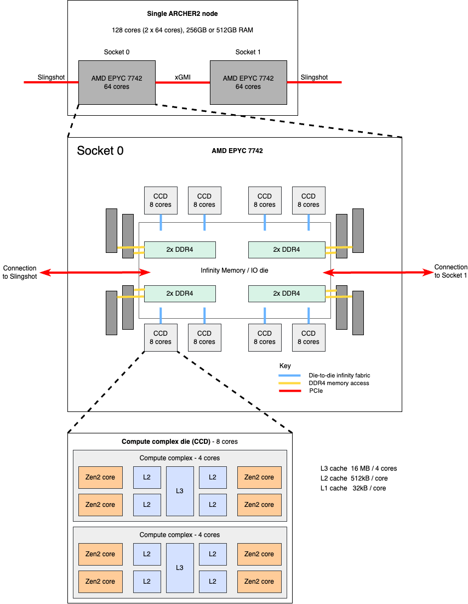

# ARCHER2 hardware

## System overview

ARCHER2 is a HPE Cray EX supercomputing system which will have a total of 5,860 compute nodes. Each compute node has 128 cores (dual AMD EPYC 7742 64 core 2.25GHz processors) giving a total of 750,080 cores. Compute nodes are connected together by a HPE Slingshot interconnect. 

There are additional User Access Nodes (UAN, also called login nodes) which provide access to the system. Compute nodes are only accessible via the Slurm job scheduling system.

There are two storage types: home and work. Home is available only on login nodes. Work is available on login and compute nodes (see [I/O and file systems](io.md)).

This is shown in the ARCHER2 architecture diagram:

## Compute node details
The compute nodes each have 128 cores. They are dual socket nodes with two 64 core AMD EPYC 7742 processors. 
!!! note
    Note due to Simultaneous Multi-Threading (SMT) each core has 2 threads, therefore a node has 128 cores / 256 threads. Most users will not want to use SMT, see [Launching parallel jobs](scheduler.md#srun-launching-parallel-jobs).

| Component          | Details                                            |
|--------------------|----------------------------------------------------|
| Processor          | 2x AMD Zen2 (Romes) EPYC 7742, 64-core, 2.25 Ghz   |
| Cores per node     | 128                                                |
| NUMA structure     | 8 NUMA regions per node (16 cores per NUMA region) |
| Memory per node    | 256 GB (standard), 512 GB (high memory)            |
| Memory per core    | 2 GB, 4 GB                                         | 
| L1 cache           | 32 kB/core                                         |
| L2 cache           | 512 kB/core                                        |
| L3 cache           | 16 MB/4-cores                                      |
| Vector support     | AVX2                                               |
| Network connection | 2x 100 Gb/s injection ports per node               |

## Memory details
The 5,568 standard nodes have 256 GB and the 292 high memory nodes have 512 GB of 8 channel DDR4 3200MHz with 204.8 GB/s peak bandwidth.

## Interconnect details
ARCHER2 has a HPE Slingshot interconnect with 200 Gb/s signalling. It uses a dragonfly topology:

- Nodes are organized into groups.
    - 128 Nodes in a group.
    - Electrical links between Network Interface Card (NIC) and switch.
    - 16 switches per group.
    - 2x NIC per node.
    - All-to-all connection amongst switches in a group using electrical links.

- All-to-all connection between groups using optical links.
    - 2 groups per ARCHER2 Cabinet.
